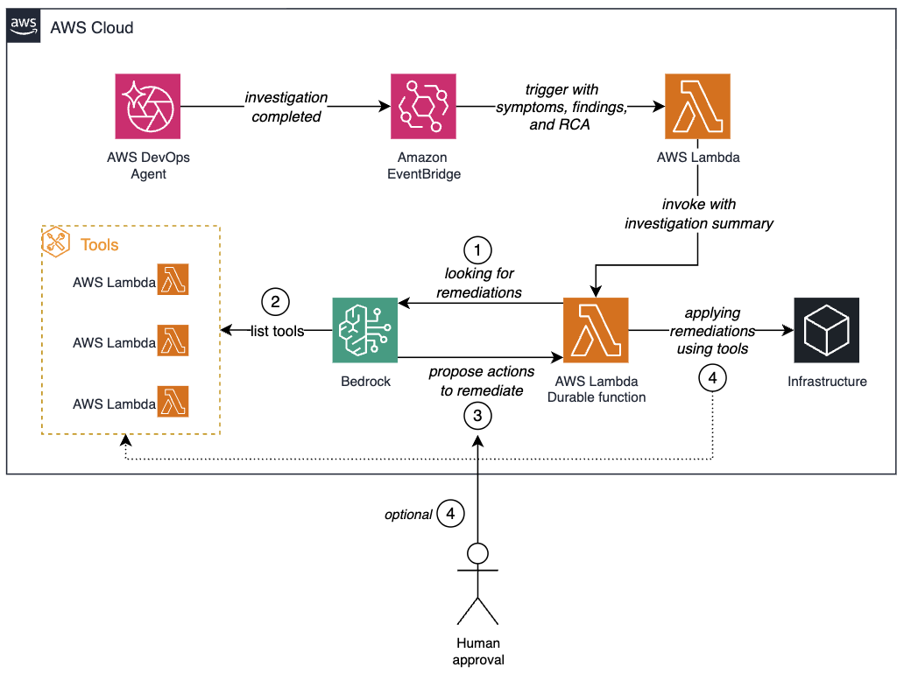

## Getting Started
This repository contains a sample CDK project that demonstrates an automated remediation pipeline for AWS DevOps Agent. It uses AWS Lambda Durable Functions, Amazon Bedrock, and Amazon EventBridge to transform DevOps Agent investigation summaries into pre-validated fixes with human-in-the-loop approval.

When DevOps Agent completes an investigation, an EventBridge rule triggers a parser Lambda that fetches the investigation summary and invokes a durable orchestrator. The orchestrator runs an agentic loop against Amazon Bedrock, executes approved tools from a curated allowlist, and suspends for human approval on any mutating action.

## Disclaimer
By implementing this solution, you acknowledge that you are responsible for owning, maintaining, and troubleshooting the solution. AWS Support may provide assistance, but ultimate responsibility for the solution's functionality and any future errors lies with you, the customer.

The successful operation of this solution relies on proper permissions and network connectivity. It is crucial to maintain the necessary permissions and verify network connectivity for the solution to function correctly.

By proceeding with the implementation, you acknowledge these considerations and agree to manage the solution accordingly and do not deploy to production without additional security testing.

## Prerequisites
- [AWS CLI](https://aws.amazon.com/cli/) is installed and configured
- [AWS CDK](https://aws.amazon.com/cdk/) is installed (`npm install -g aws-cdk`)
- Python 3.14 or later is installed
- An active [AWS DevOps Agent space](https://docs.aws.amazon.com/devopsagent/latest/userguide/getting-started-with-aws-devops-agent-creating-an-agent-space.html)
- (Optional) [Kiro](https://kiro.dev/) with the [Agent Toolkit for AWS](https://aws.amazon.com/products/developer-tools/agent-toolkit-for-aws/)

## Deployment
Clone the repository from GitHub:
```bash
git clone https://github.com/aws-samples/sample-automate-remediation-post-devops-agent-investigation
cd sample-automate-remediation-post-devops-agent-investigation/
```
Create a virtualenv on macOS and Linux:
```bash
$ python3 -m venv .venv
```
After the init process completes and the virtualenv is created, you can use the following step to activate your virtualenv:
```bash
$ source .venv/bin/activate
```
If you are using a Windows platform, you should activate the virtualenv like this:
```
% .venv\Scripts\activate.bat
```
Once the virtualenv is activated, you can install the required dependencies:
```bash
$ pip install -r requirements.txt
```
Bootstrap the AWS CDK (if this is your first CDK deployment in the region):
```bash
cdk bootstrap
```
Deploy the stack:
```bash
cdk deploy
```

**Notes**

The project deploys the following resources:
- **devops-agent-trigger** — Parser Lambda triggered by EventBridge that fetches the investigation summary and invokes the durable orchestrator
- **devops-agent-remediation-durable** — Durable Orchestrator Lambda that runs the Bedrock Converse API tool use loop and suspends for human approval on mutating actions
- **devops-agent-lambda-tool** — Tool Lambda that executes scoped AWS API calls (get/update Lambda configuration)
- **EventBridge rule** — captures `Investigation Completed` events from the `aws.aidevops` source and targets the parser Lambda

The pipeline is triggered automatically whenever DevOps Agent completes an investigation. Bedrock can only invoke tools from a curated allowlist, and each step in the workflow is logged to CloudWatch for monitoring and diagnostics.




## Simulate the incident

To demonstrate the end-to-end remediation workflow, you first need an incident for
AWS DevOps Agent to investigate. We simulate a common scenario: a Lambda function
that exceeds its configured timeout.

> If you have Kiro with the Agent Toolkit for AWS configured, you can set up the test
> function with a single prompt: *"Create a Lambda function called devops-agent-timeout
> with Python 3.14 runtime and a 3-second timeout. The function code should sleep for 10
> seconds so it always times out. Create the IAM execution role, deploy the function,
> invoke it once to generate a timeout error, and verify the timeout in CloudWatch Logs."*
> To set up the test function manually, follow the steps below.

### Create and invoke the test function

Create a simple Lambda function called `devops-agent-timeout` with a 3-second
timeout. The function code intentionally sleeps for 10 seconds, facilitating a
timeout error on every invocation.

1. Create the function code:

   ```bash
   cat > lambda_function.py << 'EOF'
   import time

   def lambda_handler(event, context):
       time.sleep(10)
       print("This line will never be reached")
       return {
           "statusCode": 200,
           "body": "Completed"
       }
   EOF
   ```

2. Create an IAM execution role for the function:

   ```bash
   aws iam create-role \
     --role-name devops-agent-timeout-role \
     --assume-role-policy-document '{
       "Version": "2012-10-17",
       "Statement": [{
         "Effect": "Allow",
         "Principal": {"Service": "lambda.amazonaws.com"},
         "Action": "sts:AssumeRole"
       }]
     }'

   aws iam attach-role-policy \
     --role-name devops-agent-timeout-role \
     --policy-arn arn:aws:iam::aws:policy/service-role/AWSLambdaBasicExecutionRole
   ```

3. Package and deploy the function:

   ```bash
   zip function.zip lambda_function.py

   aws lambda create-function \
     --function-name devops-agent-timeout \
     --runtime python3.14 \
     --handler lambda_function.lambda_handler \
     --role arn:aws:iam::<account-id>:role/devops-agent-timeout-role \
     --zip-file fileb://function.zip \
     --timeout 3
   ```

### Generate the timeout error

Invoke the function to produce the timeout:

```bash
aws lambda invoke --function-name devops-agent-timeout output.json
```

The CLI output includes a `"FunctionError": "Unhandled"` field indicating the
function did not complete successfully. To confirm the timeout, check Amazon
CloudWatch Logs:

```bash
aws logs filter-log-events \
  --log-group-name /aws/lambda/devops-agent-timeout \
  --filter-pattern "timeout"
```

You should see a log entry similar to:

```
REPORT RequestId: 663e8700-f7ce-47b8-b936-d3d48dbbde25 Duration: 3000.00 ms Billed Duration: 3093 ms Memory Size: 128 MB Max Memory Used: 36 MB Init Duration: 92.67 ms Status: timeout
```

This function simulates a workload that exceeds its configured timeout, a common
issue caused by slow downstream dependencies, increased request sizes, or
misconfigured timeout values.

With the test function in place and at least one timeout error generated, return to
the [blog post](<blog-post-url>) to follow the end-to-end validation of the solution,
from starting an investigation with AWS DevOps Agent to approving and verifying the
automated remediation.

## Clean up
To remove the resources deployed using the CDK project, you can use the `cdk destroy` command. This will delete the resources provisioned for the solution from your AWS account.

If you created the demo resources, also delete the test function and its role:
```bash
aws lambda delete-function --function-name devops-agent-timeout

aws iam detach-role-policy \
  --role-name devops-agent-timeout-role \
  --policy-arn arn:aws:iam::aws:policy/service-role/AWSLambdaBasicExecutionRole

aws iam delete-role --role-name devops-agent-timeout-role

aws logs delete-log-group --log-group-name /aws/lambda/devops-agent-timeout
```

## Security
See [CONTRIBUTING](CONTRIBUTING.md#security-issue-notifications) for more information.

## License
This library is licensed under the MIT-0 License. See the [LICENSE](LICENSE) file.
